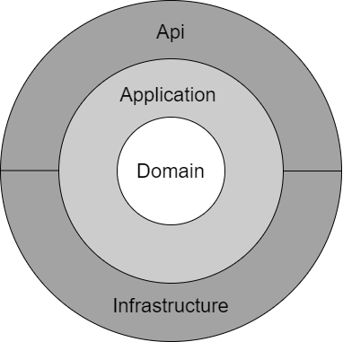

  

# MyBills API
This is a project showing how to build a Azure Functions API in .Net Core 3.1

Guide manual:
In powershell run the following:

Set environment variable:

- $env:SqlConnectionString="Data Source=(localdb)\MSSQLLocalDB;Initial Catalog=mybillsdb;Integrated Security=True;Connect Timeout=30;Encrypt=False;TrustServerCertificate=False;ApplicationIntent=ReadWrite;MultiSubnetFailover=False"

update database:
- dotnet ef database update -p src\Infrastructure -s src\Api

In case any domein entity is changed please run this command:

add migration InitialCreate:
- dotnet ef migrations add InitialCreate -p src\Infrastructure -s src\Api -o Persistence\Migrations

## Architecture DDD
The solution is design so that only the outer layers can access in the inner layers.
 
 - The **Domain** layer is responsible for representing concepts of the business, information about the business situation, and business rules. State that reflects the business situation is controlled and used here, even though the technical details of storing it are delegated to the infrastructure. This layer is the heart of business software.. 
 - The **Application** layer defines the jobs the software is supposed to do and directs the expressive domain objects to work out problems. The tasks this layer is responsible for are meaningful to the business or necessary for interaction with the application layers of other systems. This layer is kept thin. It does not contain business rules or knowledge, but only coordinates tasks and delegates work to collaborations of domain objects in the next layer down. It does not have state reflecting the business situation, but it can have state that reflects the progress of a task for the user or the program.
 - The **Infrastructure** layer is how the data that is initially held in domain entities (in memory) is persisted in databases or another persistent store. An example is using Entity Framework Core code to implement the Repository pattern classes that use a DBContext to persist data in a relational database.
 
 for more information please consult this [link to microsoft architecture](https://docs.microsoft.com/en-us/dotnet/architecture/microservices/microservice-ddd-cqrs-patterns/ddd-oriented-microservice)
 

